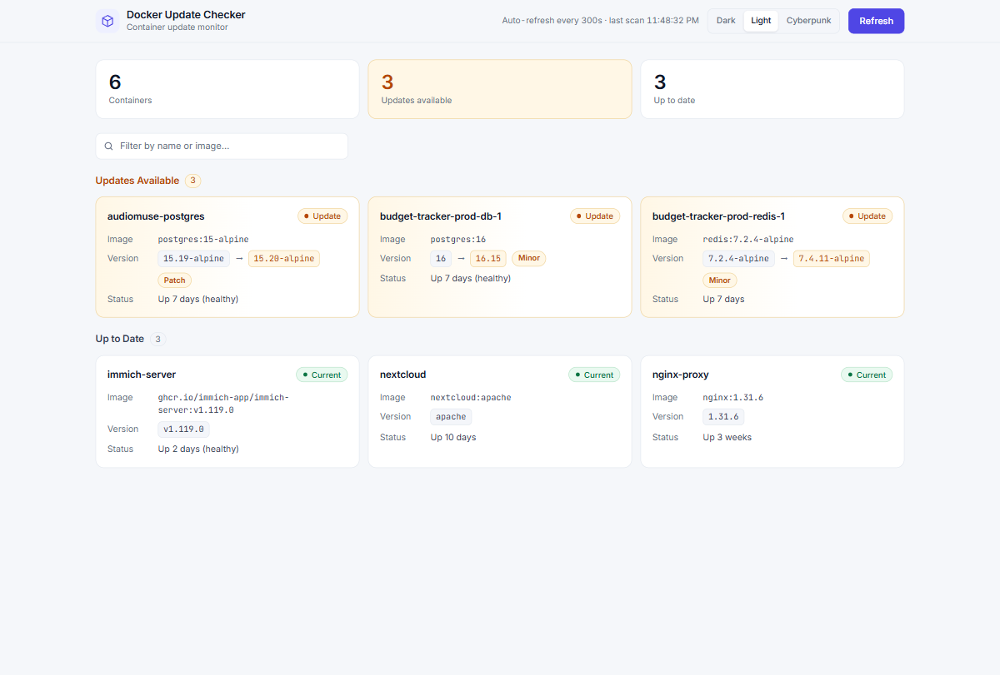
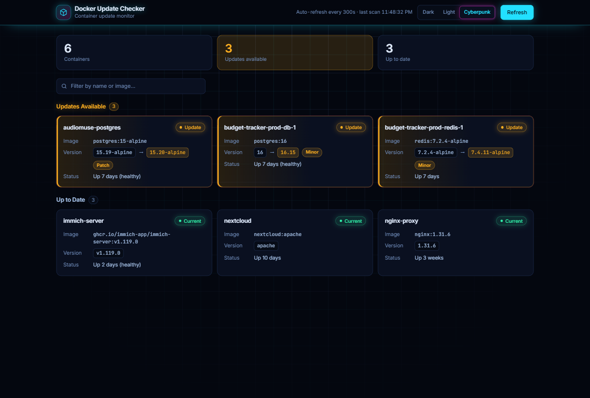

<p align="center">
  
</p>

# 🐳 Docker Update Checker

A clean, self-hosted dashboard that shows which of your running Docker containers have image updates available.


## ✨ Features

- 🔍 Monitors all running containers
- 🆕 Detects updates by digest (floating tags) or version comparison (pinned tags), with patch/minor/major
- 🐋 Docker Hub, `ghcr.io`, and `lscr.io` (auth discovered automatically)
- 🔔 Notifications via ntfy, Discord, Slack, or a generic webhook
- 🎨 Dark, Light, and Cyberpunk themes
- 🔎 Filter, auto-refresh, and a locally bundled React frontend (no CDN, works offline)

## 🖼️ Screenshots

<p align="center">
  
  
  
</p>

## 🚀 Quick Start

Create a `docker-compose.yml`:

```yaml
services:
  docker-update-checker:
    image: ghcr.io/catadoxy/docker-update-checker:latest
    container_name: docker-update-checker
    ports:
      - "3456:3456"
    volumes:
      - /var/run/docker.sock:/var/run/docker.sock:ro
    restart: unless-stopped
    environment:
      - CHECK_INTERVAL=300
```

Start it and open <http://localhost:3456>:

```bash
docker compose up -d
```

Prefer `docker run`?

```bash
docker run -d --name docker-update-checker -p 3456:3456 \
  -v /var/run/docker.sock:/var/run/docker.sock:ro --restart unless-stopped \
  -e CHECK_INTERVAL=300 ghcr.io/catadoxy/docker-update-checker:latest
```

## ⚙️ Configuration

| Variable | Default | Description |
|---|---|---|
| `CHECK_INTERVAL` | `300` | Seconds between scans (`0` disables auto-refresh) |
| `CHECK_MAJOR` | `false` | Also flag major-version upgrades |
| `PORT` | `3456` | HTTP port |

Change the port by remapping it, e.g. `- "8080:3456"`.

**Notifications** (requires `CHECK_INTERVAL > 0`):

| Variable | Channel |
|---|---|
| `NTFY_URL` (+ `NTFY_TOKEN`) | [ntfy](https://ntfy.sh) |
| `DISCORD_WEBHOOK_URL` | Discord |
| `SLACK_WEBHOOK_URL` | Slack |
| `NOTIFY_WEBHOOK_URL` | Generic JSON webhook |

**How updates are detected:**

- Floating tags (`latest`, `16`, `7-alpine`) are compared by image digest.
- Pinned tags (`1.25.3`) are compared within the same major version and variant (`-alpine`).
- Digest-pinned images (`image@sha256:...`) are never flagged.

## 🛠️ Development

```bash
npm install     # install dependencies
npm run build   # bundle the frontend into app.js
npm test        # unit tests (no Docker or network needed)
npm start       # http://localhost:3456
```

## ⚠️ Limitations

- Private registries requiring authentication are not supported yet.
- Digest comparison can differ for multi-architecture images.

## 📝 License

MIT © Dohangie Catalin
