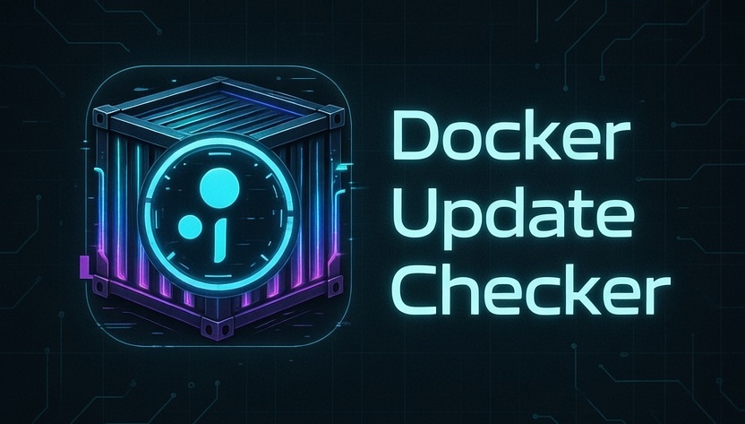
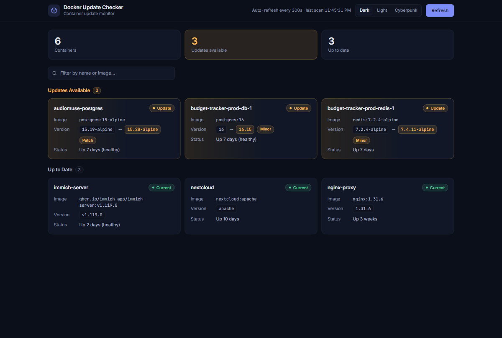

<p align="center">
  
</p>

# 🐳 Docker Update Checker

A modern web interface to monitor your Docker containers and check for available updates in real-time.


## ✨ Features

- 🔍 **Real-time monitoring** of all running Docker containers
- 🆕 **Update detection** - compares digests for floating tags (`latest`) *and* finds newer releases for pinned tags (`1.2.3`)
- 🐋 **Multi-registry support** - Docker Hub, `ghcr.io`, and `lscr.io`, with auth discovered per registry
- 🏷️ **Version display** - shows the image's real version label, plus a patch/minor/major bump type
- 🔔 **Notifications** - ntfy, Discord, Slack, or a generic webhook when new updates appear
- 🎨 **Three themes** - Cyberpunk (default), Light, and Dark
- 📊 **Statistics dashboard** showing container status at a glance
- 🔄 **Auto-refresh** interval can be set (`0` to disable)
- 🚀 **Fast and lightweight** - React bundled locally (no CDN or in-browser Babel), minimal Node.js backend
- 🐋 **Docker-compatible** - works with any Docker version

## 🖼️ Interface

The interface features:
- Animated grid background with scanline effects
- Glowing neon borders for containers with updates available
- Real-time status badges and an update-type badge (patch / minor / major / digest)
- Container cards with image, version, and status information
- Separate sections for containers with updates and up-to-date containers
- Cyberpunk, Light, and Dark themes
- Responsive design for desktop and mobile



## 🚀 Quick Start

### Prerequisites
- Docker installed
- Access to Docker socket (`/var/run/docker.sock`)

### Option 1: Docker Compose (Recommended)

1. **Create a `docker-compose.yml` file:**

   ```yaml
   services:
     docker-update-checker:
       image: ghcr.io/catadoxy/docker-update-checker:latest
       container_name: docker-update-checker
       ports:
         - "3456:3456"
       volumes:
         - /var/run/docker.sock:/var/run/docker.sock:ro
       restart: unless-stopped
       environment:
         - NODE_ENV=production
         - CHECK_INTERVAL=300  # Check every 5 minutes (300 seconds)
   ```

2. **Start the container:**

   ```bash
   docker compose up -d
   ```

3. **Access the interface:**

   Open your browser and navigate to:
   - From the same machine: `http://localhost:3456`
   - From another device on your network: `http://YOUR_SERVER_IP:3456`

### Option 2: Docker Run

```bash
docker run -d \
  --name docker-update-checker \
  -p 3456:3456 \
  -v /var/run/docker.sock:/var/run/docker.sock:ro \
  --restart unless-stopped \
  -e NODE_ENV=production \
  -e CHECK_INTERVAL=300 \
  ghcr.io/catadoxy/docker-update-checker:latest
```

Then access the interface at `http://localhost:3456`

**To stop and remove:**
```bash
docker stop docker-update-checker
docker rm docker-update-checker
```

**To update to the latest version:**
```bash
docker stop docker-update-checker
docker rm docker-update-checker
docker pull ghcr.io/catadoxy/docker-update-checker:latest
# Then run the docker run command again
```

## 🔧 Configuration

**Change the check interval:**

Edit the `CHECK_INTERVAL` environment variable:
- `60` = Check every minute
- `300` = Check every 5 minutes (default)
- `600` = Check every 10 minutes
- `0` = Disable auto-refresh (manual only)

Docker Compose:
```yaml
environment:
  - CHECK_INTERVAL=600
```

Docker Run:
```bash
-e CHECK_INTERVAL=600
```

**Change the port:**

Docker Compose - modify the port mapping:
```yaml
ports:
  - "8080:3456"  # Use port 8080 instead of 3456
```

Docker Run - change the `-p` flag:
```bash
-p 8080:3456
```

Then restart the container and access it at `http://localhost:8080`

**Updating (Docker Compose):**
```bash
docker compose pull
docker compose up -d
```

### 🔔 Notifications

Set any of the following environment variables (and keep `CHECK_INTERVAL` above 0).
The backend scans in the background and notifies you when a **new** update appears;
it remembers what it has already sent, so you won't get repeat spam.

| Variable | Channel |
|---|---|
| `NTFY_URL` (+ optional `NTFY_TOKEN`) | [ntfy](https://ntfy.sh) |
| `DISCORD_WEBHOOK_URL` | Discord |
| `SLACK_WEBHOOK_URL` | Slack |
| `NOTIFY_WEBHOOK_URL` | Generic JSON webhook |

Example:

```yaml
environment:
  - CHECK_INTERVAL=3600
  - NTFY_URL=https://ntfy.sh/my-docker-updates
```

The generic webhook receives:

```json
{
  "title": "Docker updates available (2)",
  "message": "- web (nginx:latest): 1.25.3 -> 1.27.0 [minor]",
  "updates": [ { "name": "web", "image": "nginx:latest", "latestVersion": "1.27.0", "updateType": "minor" } ]
}
```

De-duplication is in memory, so restarting the container may re-send the current set once.

## 🛠️ Development

```bash
npm install      # install dependencies
npm run build    # bundle the React frontend into app.js
npm test         # run the unit tests (node:test, no network needed)
npm start        # start the backend on http://localhost:3456
```

`app.js` is a build artifact and is not committed; the Docker build generates it
in a separate esbuild stage. Use `npm run dev` to rebuild and run with nodemon.

The backend is split into small modules so the update logic can be tested without
Docker or network access: `version.js` (tag parsing/comparison), `registry.js`
(auth discovery, digests, tags, caching), and `notify.js` (notification channels).

## 📁 Project Structure

```
docker-update-checker/
├── src/
│   ├── server.js                 # Express routes + background scan scheduler
│   ├── registry.js               # Registry client (auth, digests, tags, caching)
│   ├── version.js                # Pure version/tag helpers
│   ├── notify.js                 # Notification channels + dedupe
│   └── start.sh                  # Local dev quick-start helper
├── frontend/
│   └── app.jsx                   # React app source (bundled to app.js by esbuild)
├── test/
│   ├── version.test.js
│   ├── registry.test.js
│   └── notify.test.js
├── docs/
│   └── CHECK_INTERVAL_GUIDE.md
├── assets/                       # icon + interface preview
├── scripts/
│   └── setup-docker-compose.sh   # Automated Docker Compose setup
├── .github/workflows/            # CI + GitHub Container Registry publish
├── docker-update-checker.html    # HTML shell + styles + theme bootstrap
├── Dockerfile
├── docker-compose.yml
└── package.json
```

## 📦 Releasing

Releases are automated with GitHub Actions (`.github/workflows/publish.yml`):

```bash
git tag v1.1.0
git push --tags
```

Pushing a `v*` tag runs the tests, builds the image, and pushes
`ghcr.io/catadoxy/docker-update-checker:v1.1.0` (+ `:latest`) to the GitHub
Container Registry. It authenticates with the built-in `GITHUB_TOKEN`, so **no
repository secrets are needed**. You can also trigger it manually from the Actions
tab (`workflow_dispatch`).

> **One-time setup:** ghcr.io packages start out private. After the first publish,
> open the repo's **Packages → docker-update-checker → Package settings** and change
> its visibility to **Public** so anonymous pulls work.

### Building locally instead

If you'd rather not use the registry, build from source:

```bash
git clone https://github.com/catadoxy/docker-update-checker.git
cd docker-update-checker
# In docker-compose.yml, replace the `image:` line with `build: .`
docker compose up -d --build
```

## 🏗️ Architecture

```
┌─────────────────────┐
│   Web Browser       │
│  (React Frontend)   │
└──────────┬──────────┘
           │
           │ HTTP/REST
           │
┌──────────▼──────────┐
│   Node.js Server    │
│   (Express API)     │
└──────────┬──────────┘
           │
           │ Docker SDK
           │
┌──────────▼──────────┐     ┌──────────────────────┐
│   Docker Socket     │────▶│  Container Registries │
│  /var/run/docker    │     │  Docker Hub, ghcr.io  │
└─────────────────────┘     │  lscr.io, and more   │
                            └──────────────────────┘
```

## 🤝 How It Works

1. **Backend** connects to Docker via `/var/run/docker.sock`
2. Lists all running containers using the Docker API
3. For each container:
   - Detects the registry (Docker Hub, ghcr.io, lscr.io) and discovers its auth endpoint
   - Gets the current image digest (SHA) and version label
   - For floating tags (`latest`), compares the local and remote digests
   - For version tags, finds the newest stable release in the same variant and reports the bump type
   - Ignores prereleases and unrelated variants (e.g. `-alpine`)
4. **Frontend** polls the API at the configured interval and displays results

## 🐛 Troubleshooting

### "Failed to connect to Docker"

- Ensure Docker is running: `docker ps`
- Check Docker socket permissions: `ls -l /var/run/docker.sock`
- On Linux, you may need to add your user to the docker group: `sudo usermod -aG docker $USER`

### "No containers detected"

- Make sure you have running containers: `docker ps`
- Check that the backend can access Docker: `curl http://localhost:3456/api/health`

### Update detection not working

- Private registries requiring authentication are not yet supported
- Supported public registries: Docker Hub, `ghcr.io`, `lscr.io`
- Images without tags or with SHA digests may show as "unknown"
- Digest comparison can differ for multi-architecture images

## 🔒 Security Notes

- This tool requires access to the Docker socket, which provides root-level access
- Only run this on trusted networks or localhost
- Do not expose port 3456 to the internet without proper authentication
- Consider using Docker socket proxy for production deployments

## 📝 License

MIT License - feel free to use this for personal or commercial projects!

## 🙏 Credits

Built with:
- [Express](https://expressjs.com/) - Fast, minimalist web framework
- [Dockerode](https://github.com/apocas/dockerode) - Docker API client
- [React](https://reactjs.org/) - UI library
- [esbuild](https://esbuild.github.io/) - Frontend bundler
- [Axios](https://axios-http.com/) - HTTP client

Fonts:
- [JetBrains Mono](https://www.jetbrains.com/lp/mono/) - Monospace font
- [Orbitron](https://fonts.google.com/specimen/Orbitron) - Display font

## 🐛 Known Issues

- Authentication for private images is not implemented
- Supported registries: Docker Hub, `ghcr.io`, `lscr.io` (no `gcr.io`/`quay.io` yet)
- Digest comparison may be inaccurate for multi-architecture images
- Notification de-duplication is in memory, so a restart may resend the current set
- Windows Docker Desktop may require additional configuration

## 🚀 Future Enhancements

- [x] Multi-registry support (Docker Hub, ghcr.io, lscr.io)
- [x] Notifications (ntfy, Discord, Slack, generic webhook)
- [x] Multiple themes (Cyberpunk, Light, Dark)
- [ ] Support for private registries
- [ ] Authentication for private images
- [ ] Container restart/update actions
- [ ] Export reports
- [ ] Filter and search capabilities
- [ ] Email notifications

## 💬 Feedback

If you encounter issues or have suggestions, feel free to open an issue!

---

Made with 💙 for the Docker community
