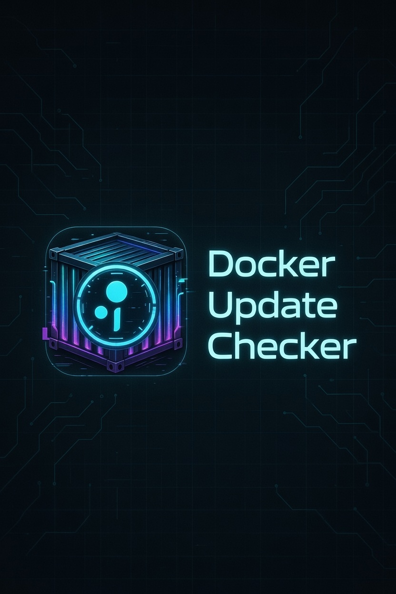

# 🐳 Docker Update Checker

A modern, cyberpunk-themed web interface to monitor your Docker containers and check for available updates in real-time.


<p align="center">
  
</p>

## ✨ Features

- 🔍 **Real-time monitoring** of all running Docker containers
- 🆕 **Update detection** by comparing local image digests against the registry
- 🐋 **Multi-registry support** - Docker Hub, `ghcr.io`, and `lscr.io`
- 🏷️ **Version display** - shows the image's real version label instead of just `tag:latest`
- 🎨 **Cyberpunk terminal aesthetic** with neon colors and animations
- 📊 **Statistics dashboard** showing containers status at a glance
- 🔄 **Auto-refresh** refresh interval can be set (0 to disable autorefresh)
- 🚀 **Fast and lightweight** - pure React frontend, minimal Node.js backend
- 🐋 **Docker-compatible** - works with any Docker version

## 🖼️ Interface

The interface features:
- Animated grid background with scanline effects
- Glowing neon borders for containers with updates available
- Real-time status badges
- Container cards with image, version, and status information
- Responsive design for desktop and mobile

## 🚀 Quick Start

### Prerequisites
- Docker and Docker Compose installed
- Access to Docker socket (`/var/run/docker.sock`)

### Installation

1. **Create a `docker-compose.yml` file:**
```yaml
   services:
     docker-update-checker:
       image: catadoxy/docker-update-checker:latest
       container_name: docker-update-checker
       ports:
         - "3456:3456"
       volumes:
         - /var/run/docker.sock:/var/run/docker.sock:ro
       restart: unless-stopped
       environment:
         - NODE_ENV=production
         - CHECK_INTERVAL=300  # Check every 5 minutes (300 seconds)
```

2. **Start the container:**
```bash
   docker compose up -d
```

3. **Access the interface:**
   
   Open your browser and navigate to:
   - From the same machine: `http://localhost:3456`
   - From another device on your network: `http://YOUR_SERVER_IP:3456`

## 🔧 Configuration

**Change the check interval:**
Edit the `CHECK_INTERVAL` value in your docker-compose.yml:
- `60` = Check every minute
- `300` = Check every 5 minutes (default)
- `600` = Check every 10 minutes
- `0` = Disable auto-refresh (manual only)

**Change the port:**

Modify the port mapping in docker-compose.yml:
```yaml
ports:
  - "8080:3456"  # Use port 8080 instead of 3456
```

Then restart:
```bash
docker compose down
docker compose up -d
```

## 🐛 Troubleshooting

### "Failed to connect to Docker"

- Ensure Docker is running: `docker ps`
- Check Docker socket permissions: `ls -l /var/run/docker.sock`
- On Linux, you may need to add your user to the docker group: `sudo usermod -aG docker $USER`

### "No containers detected"

- Make sure you have running containers: `docker ps`
- Check that the backend can access Docker: `curl http://localhost:3456/api/health`

### Update detection not working

- Private registries requiring authentication are not yet supported
- Supported public registries: Docker Hub, `ghcr.io`, `lscr.io`
- Images without tags or with SHA digests may show as "unknown"
- Digest comparison can differ for multi-architecture images

## 🔒 Security Notes

- This tool requires access to the Docker socket, which provides root-level access
- Only run this on trusted networks or localhost
- Do not expose the API port (3456) to the internet without proper authentication
- Consider using Docker socket proxy for production deployments

## 🏗️ Architecture

```
┌─────────────────────┐
│   Web Browser       │
│  (React Frontend)   │
└──────────┬──────────┘
           │
           │ HTTP/REST
           │
┌──────────▼──────────┐
│   Node.js Server    │
│   (Express API)     │
└──────────┬──────────┘
           │
           │ Docker SDK
           │
┌──────────▼──────────┐     ┌─────────────────┐
│   Docker Socket     │────▶│ Container       │
│  /var/run/docker    │     │ Registry API    │
└─────────────────────┘     └─────────────────┘
```

## 🤝 How It Works

1. **Backend** connects to Docker via `/var/run/docker.sock`
2. Lists all running containers using Docker API
3. For each container:
   - Extracts image name and tag
   - Gets the current image digest (SHA)
   - Queries the registry for the digest and highest version tag
   - Compares digests to determine if an update is available
4. **Frontend** polls the API at the configured `CHECK_INTERVAL` and displays results

## 📁 Project Structure

```
docker-update-checker/
├── src/
│   ├── server.js                 # Express backend + registry logic
│   └── start.sh                  # Local dev quick-start helper
├── docs/
│   ├── README.md
│   ├── CHECK_INTERVAL_GUIDE.md
│   └── assets/logo.jpg
├── scripts/
│   └── setup-docker-compose.sh   # Automated Docker Compose setup
├── docker-update-checker.html    # Single-file React frontend
├── Dockerfile
├── docker-compose.yml
└── package.json
```

## 📝 License

MIT License - feel free to use this for personal or commercial projects!

## 🙏 Credits

Built with:
- [Express](https://expressjs.com/) - Fast, minimalist web framework
- [Dockerode](https://github.com/apocas/dockerode) - Docker API client
- [React](https://reactjs.org/) - UI library
- [Axios](https://axios-http.com/) - HTTP client

Fonts:
- [JetBrains Mono](https://www.jetbrains.com/lp/mono/) - Monospace font
- [Orbitron](https://fonts.google.com/specimen/Orbitron) - Display font

## 🐛 Known Issues

- Authentication for private images is not implemented
- Supported registries: Docker Hub, `ghcr.io`, `lscr.io` (no `gcr.io`/`quay.io` yet)
- Digest comparison may be inaccurate for multi-architecture images
- Windows Docker Desktop may require additional configuration

## 🚀 Future Enhancements

- [x] Multi-registry support (Docker Hub, ghcr.io, lscr.io)
- [ ] Support for private registries
- [ ] Authentication for private images
- [ ] Update notifications via webhook
- [ ] Container restart/update actions
- [ ] Export reports
- [ ] Filter and search capabilities
- [ ] Email/Slack notifications

## 💬 Feedback

If you encounter issues or have suggestions, feel free to open an issue!

---

Made with 💙 for the Docker community
